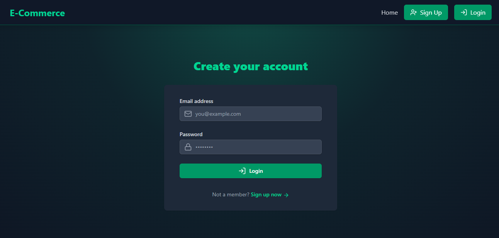
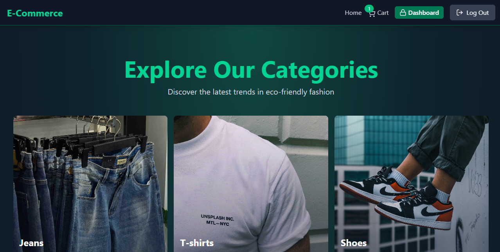
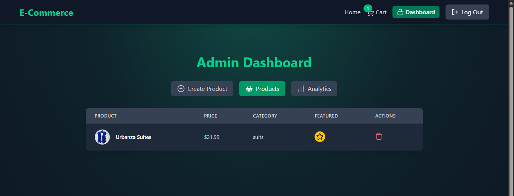

# 🛍️ E-commerce-store 🚀

<p align="center">
  
  
  
  
  
  
</p>

**Build fast, scalable, and interactive web apps effortlessly.**

A modern E-commerce web application built with **React** and **Node.js**, designed to provide a seamless shopping experience.

---

<p align="center">
    <a href="https://resume-eta-swart.vercel.app/">
    
  </a>
  <a href="https://resume-eta-swart.vercel.app/">
    
  </a>
  <a href="https://resume-eta-swart.vercel.app/">
    
  </a>

  
</p>

---

<p align="center">
  <a href="https://e-commerce-store-r1ub.onrender.com/">
    
  </a>
</p>

---


## 📑 Table of Contents

- [📝 E-commerce-store](#-E-commerce-store)
  - [📑 Table of Contents](#-table-of-contents)
  - [🚀 Features](#-features)
  - [🛠️ Tech Stack](#️-tech-stack)
  - [⚙️ Getting Started](#️-getting-started)
    - [Prerequisites](#prerequisites)
    - [Installation](#installation)
  - [Environment Variables](#environment-variables)
    - [Backend .env:](#backend-env)
    - [Frontend .env:](#frontend-env)
    - [Backend (dev)](#backend-dev)
    - [Frontend (dev)](#frontend-dev)
  - [📂 Folder Structure](#-folder-structure)

---


## ⚙️ Tech Stack

### 🧩 Frontend  


### ⚙️ Backend  


### 🗄️ Database  


### 🔐 Authentication  


### 🧰 Other Tools  


---

## ✨ Features

✅ User authentication with JWT  
✅ Responsive UI with Tailwind CSS  
✅ RESTful API integration  
✅ CRUD operations for products and users  
✅ Payment Integration
✅ Role-based access control  
✅ Deployment-ready setup


---

## ⚙️ Getting Started

### Prerequisites

- Node.js (v16+)
- npm or yarn
- MongoDB (local or Atlas)


## 🧩 Installation

```bash
# Clone repository
git clone https://github.com/hilla10/e-commerce-store.git

# Navigate to project

# Install backend dependencies
cd e-commerce-store
npm install

# Install frontend dependencies
cd ../frontend 
npm install
```

## Environment Variables

### Backend .env:
```bash
MONGODB_URI =your_mongodb_uri
UPSTASH_REDIS_URL=your_upstash_url
ACCESS_TOKEN_SECRET=your_access_token
REFRESH_TOKEN_SECRET=your_refresh_token
CLOUDINARY_NAME=your_cloudinary_name
CLOUDINARY_API_KEY=your_cloudinary_api_key
CLOUDINARY_API_SECRET=your_cloudinary_secret
STRIPE_SECRET_KEY=your_stripe_key
CLIENT_URL=your_client_url
NODE_ENV = development

```
### Backend (dev)

```bash
cd e-commerce-store
npm run dev
```


### Frontend (dev)

```bash
cd frontend
npm run dev
```


## 📂 Folder Structure

```

e-commerce-store/
├── backend/
│   ├── controllers/
│   ├── models/
│   ├── routes/
│   ├── middleware/
│   └── server.js
├── frontend/
│   ├── public/
│   ├── src/
│   │   ├── components/
│   │   ├── pages/
│   │   ├── app/
│   │   ├── api/
│   │   └── App.jsx
├── README.md
└── package.json
```

📄 License

MIT License

👤 Contact

<p align="left"> <a href="https://github.com/hilla10">GitHub</a> • <a href="https://www.linkedin.com/in/hailemichaelnegusse/">LinkedIn</a> </p>
